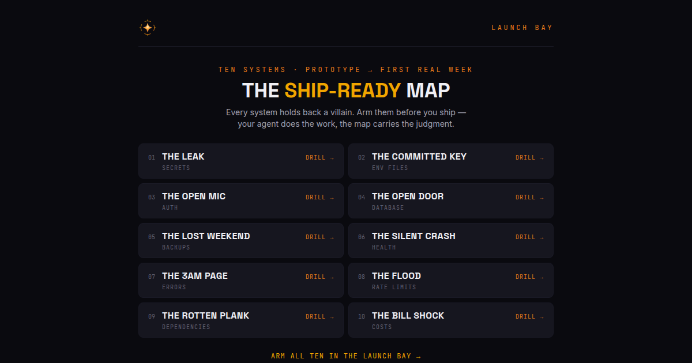

# SkillBoss Dojo — the seven-hall path

SkillBoss is a daily DevOps boss fight: one themed run a day, one shot per
question, no replay — train in the dojo, prove it against the boss at
**[skillboss.dev](https://skillboss.dev)**.

This repo is the open half of that dojo: the seven-hall learning path and a
growing bank of **katas** — fill-the-blank exercises over real artifacts
(commands, pipelines, manifests, runbooks), each with a folded solution and
the *why* behind every token.

## What this repo is — and is not

- **It is** a free, self-contained training path. Every kata here is the
  same content that runs inside the product, exported as-is: scenario,
  artifact, token pool, solution folded behind a spoiler, why-notes.
- **It is not** the SkillBoss application. The app's code is a separate,
  private codebase and is not open source. This repo's content is licensed
  [CC BY-SA 4.0](LICENSE) — share it, adapt it, keep it open (see
  [License](#license)).
- **No inflated claims.** You won't find "join 10,000 developers" here
  until it's true. The product publishes real numbers or none.

## How the path works

Seven halls, one per domain. Inside SkillBoss each hall has its day: its
boss runs daily on a weekly wheel, and the day's kata trains the same
theme. Here, work through a hall's checklist top to bottom, do its katas,
then face its boss live.

Check items off by forking this repo or copying a hall's list into your
notes — the checklist is yours, not a tracked profile.

---

### ☀️ Sunday — DevSecOps & Security · *The Gatekeeper*

AppSec, secrets, and supply chain: the hall where leaks are contained
before they become incidents.

- [ ] Keep secrets out of git (`.gitignore`, env files, pre-commit scanning)
- [ ] Rotate-first incident response for exposed credentials
- [ ] Scope tokens and service accounts to least privilege
- [ ] Harden the dependency chain (lockfiles, audit, provenance)
- [ ] Recognize the common injection and misconfiguration classes

**Katas in this repo:** [Harden the dependency chain](katas/security/harden-the-dependency-chain.md) · [Move the key out of the code](katas/security/move-the-key-out-of-the-code.md) · [Scope the service token](katas/security/scope-the-service-token.md) · [Stop the secret leak](katas/security/stop-the-secret-leak.md)
**Train it live:** [skillboss.dev](https://skillboss.dev) — The Gatekeeper takes challengers every Sunday.

### 🌙 Monday — Agile & Team Flow · *The Cadence*

Team flow, planning, and delivery practices — the half of the job AI
can't do for you.

- [ ] Split oversized stories into shippable slices
- [ ] Estimate with assumptions attached, not bare numbers
- [ ] Run retros that change the next sprint, not just vent
- [ ] Keep the board honest: WIP limits and unclogging flow
- [ ] Communicate during incidents: recover first, blame never

**Katas in this repo:** [Pick the next thing by evidence](katas/agile/pick-the-next-thing-by-evidence.md) · [Rewire the retro](katas/agile/rewire-the-retro.md) · [Split the monster story](katas/agile/split-the-monster-story.md) · [Unclog the board](katas/agile/unclog-the-board.md)
**Train it live:** [skillboss.dev](https://skillboss.dev) — The Cadence takes challengers every Monday.

### 🔀 Tuesday — Git & Version Control · *The Merge Warden*

Version control workflows under pressure: recovery, history surgery, and
pushing without stomping teammates.

- [ ] Recover "lost" commits with `reflog` after a bad force-push
- [ ] Know your resets: `--soft` vs `--mixed` vs `--hard`
- [ ] Push safely: `--force-with-lease` over bare `--force`
- [ ] Hunt regressions with `bisect`
- [ ] Carry fixes across branches: `cherry-pick` vs `merge` vs `rebase`

**Katas in this repo:** [Carry the fix across branches](katas/git/carry-the-fix-across-branches.md) · [Hunt the bad commit](katas/git/hunt-the-bad-commit.md) · [Recover the lost branch](katas/git/recover-the-lost-branch.md)
**Train it live:** [skillboss.dev](https://skillboss.dev) — The Merge Warden takes challengers every Tuesday.

### ⚙️ Wednesday — Containers & Kubernetes · *The Orchestrator*

Containers, images, orchestration, and workloads — from crash loops to
clean rollouts.

- [ ] Read a crash-looping pod: `describe`, `logs`, probes
- [ ] Right-size requests and limits without guessing
- [ ] Roll out without a cliff: strategies, readiness, surge
- [ ] Build small, safe images (layers, users, scanning)
- [ ] Know what the control plane actually reconciles

**Katas in this repo:** [First container, first deploy](katas/k8s/first-container-first-deploy.md) · [Fix the crash-looping rollout](katas/k8s/fix-the-crash-looping-rollout.md) · [Right-size the pod](katas/k8s/right-size-the-pod.md) · [Roll out without a cliff](katas/k8s/roll-out-without-a-cliff.md)
**Train it live:** [skillboss.dev](https://skillboss.dev) — The Orchestrator takes challengers every Wednesday.

### ☁️ Thursday — Cloud & Infrastructure · *The Nimbus*

Cloud infrastructure and IAM: the hall of open buckets, shared state, and
idle bills.

- [ ] Close the public bucket before it closes your company
- [ ] IAM: least privilege as the default, not the cleanup
- [ ] Manage shared infrastructure state safely (locking, backends)
- [ ] Stop paying for idle: right-sizing and scale-to-zero
- [ ] Understand the blast radius of a region or zone failure

**Katas in this repo:** [Close the open bucket](katas/cloud/close-the-open-bucket.md) · [Stop paying for idle](katas/cloud/stop-paying-for-idle.md) · [Tame the shared state](katas/cloud/tame-the-shared-state.md)
**Train it live:** [skillboss.dev](https://skillboss.dev) — The Nimbus takes challengers every Thursday.

### 🚦 Friday — Pipelines & CI/CD · *The Pipeline*

Pipelines and delivery: gates, secrets, and shipping without white
knuckles.

- [ ] Gate deploys on tests — structurally, not by convention
- [ ] Keep secrets out of pipeline YAML and logs
- [ ] Kill flaky suites instead of retrying them into green
- [ ] Progressive delivery: keep an exit while flipping traffic
- [ ] Make rollback a button, not a war room

**Katas in this repo:** [Flip the traffic, keep the exit](katas/ci-cd/flip-the-traffic-keep-the-exit.md) · [Gate the deploy job](katas/ci-cd/gate-the-deploy-job.md) · [Kill the flaky suite](katas/ci-cd/kill-the-flaky-suite.md) · [Ship on push, not on memory](katas/ci-cd/ship-on-push-not-on-memory.md)
**Train it live:** [skillboss.dev](https://skillboss.dev) — The Pipeline takes challengers every Friday.

### 🔥 Saturday — SRE & Observability · *The Firewatch*

Reliability engineering, metrics, and observability: promises you can
measure, pages you can trust.

- [ ] Define the promise: SLIs and SLOs that mean something
- [ ] Page on burn rate, not on blips
- [ ] Run the incident, not the panic: roles, comms, timeline
- [ ] Write blameless postmortems that change the system
- [ ] Budget errors like the finite resource they are

**Katas in this repo:** [Define the promise](katas/sre/define-the-promise.md) · [Page on burn, not on blips](katas/sre/page-on-burn-not-on-blips.md) · [Run the incident, not the panic](katas/sre/run-the-incident-not-the-panic.md) · [Wire the zero-th monitor](katas/sre/wire-the-zero-th-monitor.md)
**Train it live:** [skillboss.dev](https://skillboss.dev) — The Firewatch takes challengers every Saturday.

---

## The katas

Every kata follows the same discipline:

1. **Scenario** — one or two lines of real pressure, no trivia.
2. **Artifact** — a realistic command sequence, config, or manifest with
   blanks.
3. **Pool** — the tokens, correct answers mixed with plausible near-misses.
4. **Hints** — folded, no answers.
5. **Solution + why-notes** — folded behind `
`, always below the
   exercise. Spoilers are opt-in here for the same reason the product never
   shows correctness mid-run.

Want to write one? Read [CONTRIBUTING.md](CONTRIBUTING.md) — every
submission gets the same human review as our generated content.

## The Ship Check 10

[`skills/skillboss-devops-check/SKILL.md`](skills/skillboss-devops-check/SKILL.md)
is a pre-ship hygiene review you install into **your own agent** — Claude
Code, Cursor, Copilot, or anything that reads markdown instructions. Your
agent does the looking; the skill supplies the judgment: ten checks
(secrets, env hygiene, auth coverage, database exposure, backups, health,
error monitoring, rate limiting, dependencies, cost guardrails), each
anchored to a documented breach class, each ending in an honest verdict —
including "can't verify" when the evidence isn't in your repo.

**Install:**

- **Claude Code** — copy the folder into your repo:
  `mkdir -p <your-repo>/.claude/skills && cp -r skills/skillboss-devops-check <your-repo>/.claude/skills/`,
  then ask Claude to "run the ship check".
- **Cursor / Copilot / other** — paste `SKILL.md` into your rules or
  instructions file (e.g. `.cursor/rules/`), then ask your agent to run
  the Ship Check 10 against the repo.

**Its limits, honestly:** it is a heuristic review by your own agent — not
an audit, not a pentest, not a guarantee, and it certifies nothing about
your app.

**Prefer an outside pair of eyes?** The same ten checks, run by a human on
an app they didn't write, are a paid service — scope, method, and a sample
deliverable are described here:
[Pre-launch review](https://mazzyst.github.io/skillboss-dojo/review/). Also
heuristic, and it says so.

## The Ship-Ready Starter Pack

[`ship-ready/`](ship-ready/) is the same judgment, aimed at the moment you
START a project instead of the moment you ship it. Ten systems, each
holding back a named villain, each linking a free drill:

- **[`SHIP-READY.md`](ship-ready/SHIP-READY.md)** — the floor. Paste it
  whole into your coding agent and let it apply the ten systems to your
  project.
- **[`rules/`](ship-ready/rules/)** — the floor as standing agent rules,
  per stack (generic, Next.js + Supabase, Lovable). Same text works as
  Cursor rules, CLAUDE.md material, or Copilot instructions. Missing your
  stack? Pull requests welcome.
- **[`INCIDENTS.md`](ship-ready/INCIDENTS.md)** — real incidents from the
  vibe-coding wave, blameless and cited, each mapped to the reflex that
  would have stopped it.
- **[`ci/secret-scan.yml`](ship-ready/ci/secret-scan.yml)** — a drop-in
  workflow that blocks the next hardcoded key before it enters history.

The guided room lives at [skillboss.dev/launch](https://skillboss.dev/launch)
— brief, floor, and drill, one tap from your clipboard. Same limits as the
Ship Check, honestly: heuristics your own agent applies, not a guarantee,
and it certifies nothing about your app.

## The Start Guide

**Free · offline · Apache-2.0**

[`start-guide/`](start-guide/) is a delivery coach for the moment BEFORE
the first line of code. Unzip it into your repository, say **Hello World**
to your coding agent, and your project is walked through ten locked
gates — kickoff, working with AI agents, architecture, security by design,
tests, CI/CD, Docker, deployment, observability, and the final boss:
SHIP. Nothing gets built until the first gate opens; nothing advances
without evidence and your explicit GO.

- **[`HELLO-WORLD.md`](start-guide/HELLO-WORLD.md)** — the wake-up. Your
  agent reads it once; the coach is on.
- **[`THE-RUN.md`](start-guide/THE-RUN.md)** — the method in one page:
  Evidence-Gated Delivery, four laws, two paths.
- **[`gates/`](start-guide/gates/)** — the ten gates, each with its
  guardrails, its boxes and the villains it faces.
- **[`hooks/`](start-guide/hooks/)** — three rules that ship as real git
  hooks (no secret committed, no environment file in git, no red suite
  pushed) and a fourth that draws your run screen after every commit.
  Offline, from your own git history.
- **[`USER-GUIDE.en.md`](start-guide/USER-GUIDE.en.md)** ·
  **[`USER-GUIDE.fr.md`](start-guide/USER-GUIDE.fr.md)** — the human's
  guide, in English and French.

The folder is, byte for byte, the ZIP served at
[skillboss.dev/start](https://skillboss.dev/start), where the checksum is
printed; each version is also a release on this repository with that one
asset. It works offline, forever: no network call, no telemetry, no
account.

> The Start Guide is a coach, not a certification: its guardrails are
> heuristic defaults applied by your own agent. It hardens the builder;
> it never certifies the app.

**Ran it?** Open a *Run report* issue — the public repository that holds
your filled `state/journal.md`, the RUN CLEARED line, what held, what the
kit got wrong. It says what you did; it certifies nothing about your app.

**The author runs it too.** [`EXAMPLE-RUN-LIVE.md`](EXAMPLE-RUN-LIVE.md) is
the journal of the SkillBoss run itself — the gate reports with their
evidence, and the defects that run found in this kit. Rendered from the
repository's own `state/journal.md`, never edited here.

## Try it without an account

The product has a free demo at
[skillboss.dev/demo](https://skillboss.dev/demo) — same one-shot mechanic,
sample content, nothing recorded.

## License

The **content** of this repository (katas, path, docs) is licensed under
[Creative Commons Attribution-ShareAlike 4.0 International](LICENSE)
(CC BY-SA 4.0): use it, adapt it, teach with it — credit SkillBoss and
keep derivatives under the same license.

The **SkillBoss application** (backend, frontend, infrastructure) is a
separate work, not covered by this license and not open source.

The **Start Guide** (`start-guide/`) is the exception: it is licensed
[Apache-2.0](start-guide/LICENSE) with a [NOTICE](start-guide/NOTICE) that
travels with every copy, so it can be adapted and redistributed,
including commercially. The SkillBoss name and brand are not licensed by
either license and never badge an application.
